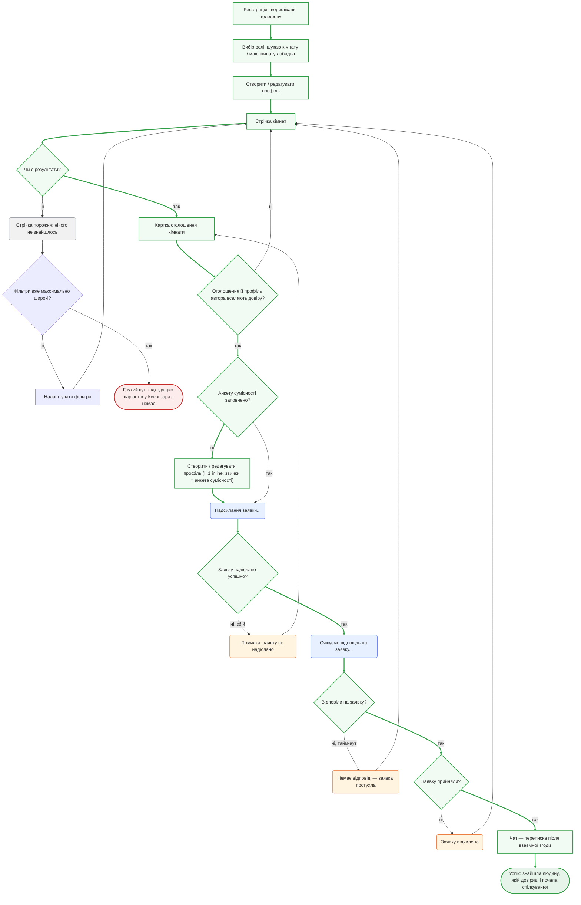
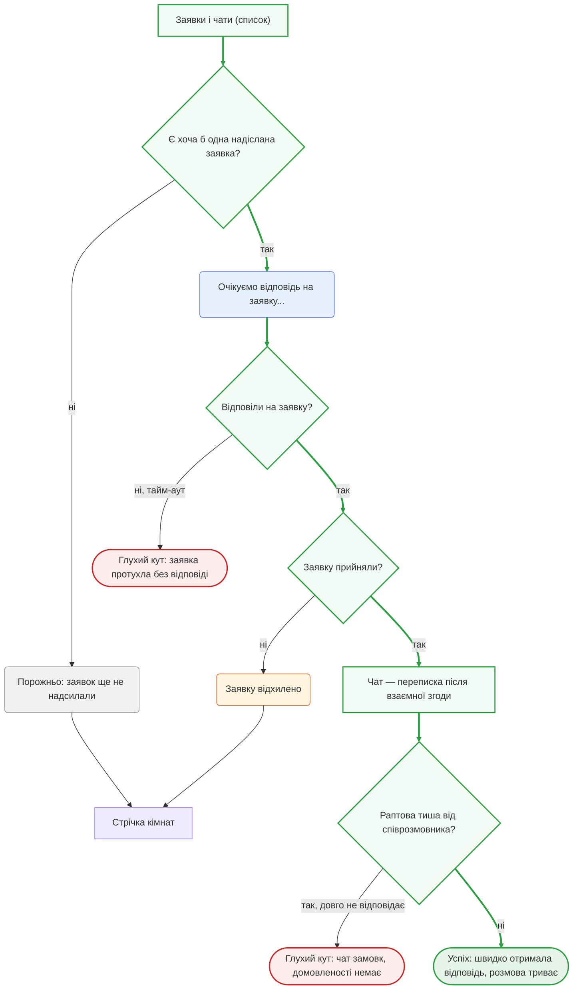
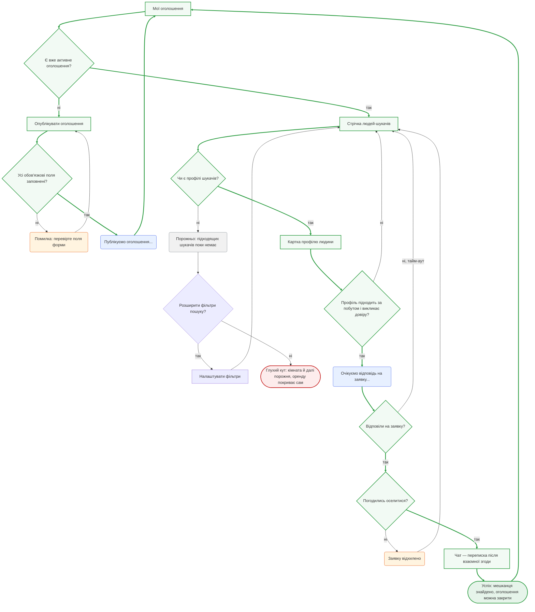
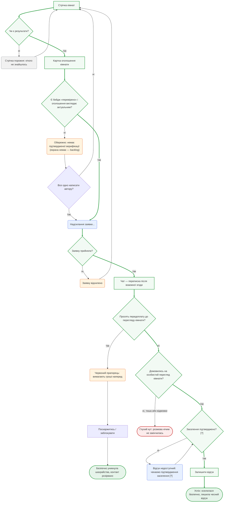

# Куток — user flows

> Побудовано на екранах з `sitemap.md` (розділ «Екрани») — жодного нового
> екрана не вигадано, усі назви вузлів-екранів дослівно збігаються з
> sitemap.md. Job-и — з `jtbd.md`. Кожен flow навмисно НЕ happy-path: містить
> порожні стани, помилки, очікування і глухі кути, де людина може застрягти.

**Легенда форми вузлів:**
- `["Назва екрана"]` — прямокутник, реальний екран із sitemap.md
- `{"Питання?"}` — ромб, точка рішення
- `("Стан")` — заокруглений прямокутник, проміжний стан (порожньо / завантаження / помилка), веде далі
- `(["Результат"])` — стадіон, кінцева точка: успіх або глухий кут

---

## Flow 1 — Головний job: «Безпечно знайти, з ким і де жити»

> jtbd.md, «Головний job продукту»: *«Коли я шукаю, з ким і де жити в Києві,
> я хочу знайти людину чи кімнату, якій можу довіряти, щоб оселитися без
> стресу й ризику»*. Primary-персона — Марічка. Це повний flow: від першого
> входу до моменту, коли довірений контакт установлено. Дієслово job —
> «знайти» (довірений варіант); момент заселення й відгуку — це вже окремий
> Emotional 1 flow нижче, а не частина цього.

**Рішення:**
- *Чи є результати?* — фільтр/стрічка повернули хоч одне оголошення в межах Києва.
- *Фільтри вже максимально широкі?* — розрізняє тимчасово вузький запит (можна розширити) від справжньої відсутності пропозицій.
- *Оголошення й профіль автора вселяють довіру?* — момент, заради якого будується вся довірча інфраструктура (рівні довіри, факти перевірки з датою, звички, актуальність) — головна точка ухвалення рішення в job.
- *Анкету сумісності заповнено?* — анкета = звички профілю (II.1). Якщо їх ще немає, вони вперше заповнюються inline у флоу заявки й далі підтягуються автоматично; на заявці — стан «Анкету з профілю додано» (рішення 2026-09-24, з прототипу уроку 6).
- *Заявку надіслано успішно?* — технічна розвилка (мережа/сервер), не про людину.
- *Відповіли на заявку?* — тайм-аут проти реальної відповіді.
- *Заявку прийняли?* — явна відмова іншої сторони проти згоди.

**Стани:**
- **Порожньо** — «Стрічка порожня: нічого не знайшлось» — фільтр надто вузький, звідси є вихід (розширити фільтри) і немає (справжній дефіцит пропозицій).
- **Завантаження** — «Надсилання заявки...» і «Очікуємо відповідь на заявку...» — людина чекає на систему й на іншу сторону відповідно.
- **Помилка** — «Помилка: заявку не надіслано» (збій) і «Заявку відхилено» (свідома відмова) — два різні за природою випадки, обидва вимагаються завданням явно.
- **Глухий кут (тупик)** — «Підходящих варіантів у Києві зараз немає»: фільтри вже широкі, а стрічка порожня — продукт більше нічого запропонувати не може, людина застрягла поза межами застосунку.
- **Успіх** — довірений контакт установлено, чат відкрито: головний job закритий.

---

## Flow 2 — Related 3: «Швидко достукатись і отримати відповідь»

> jtbd.md, Related 3: *«Коли я знаходжу підходящий варіант, я хочу швидко
> достукатись до автора й отримати відповідь, щоб не втратити його, поки
> шукають інші»*. На відміну від Flow 1 (одна заявка, один прохід), тут
> погляд з боку «Заявки і чати» як центру керування — кілька заявок одразу,
> тиша від співрозмовника, конкуренція за час. Primary-персона — Марічка,
> ідентично для Насті.

**Рішення:**
- *Є хоча б одна надіслана заявка?* — розрізняє нового користувача (ще нічого не надсилав) від того, хто вже в процесі.
- *Відповіли на заявку?* — тайм-аут проти реальної відповіді (той самий вузол, що й у Flow 1, тут — у контексті керування чергою заявок).
- *Заявку прийняли?* — явна відмова проти згоди на чат.
- *Раптова тиша від співрозмовника?* — job «швидко отримати відповідь» не закінчується самим фактом відкриття чату: розмова може загаснути й після взаємної згоди.

**Стани:**
- **Порожньо** — «Заявок ще не надсилали» — новий користувач, веде назад у стрічку почати пошук.
- **Завантаження** — «Очікуємо відповідь на заявку...» — чиста реалізація самого job: швидкість відповіді тут головна метрика.
- **Помилка** — «Заявку відхилено» — сторона відмовилась.
- **Глухий кут (тупик)** — два різних: заявка протухла без жодної відповіді, або чат відкрився, але замовк — обидва не дають людині продовжити цю конкретну лінію спілкування.
- **Успіх** — швидка відповідь отримана, розмова жива.

---

## Flow 3 — Related 5: «Швидко знайти нового мешканця» (Олег, secondary)

> jtbd.md, Related 5: *«Коли кімната несподівано звільняється, я хочу
> швидко знайти нового мешканця, щоб не покривати цю частку оренди
> самостійно»*. На відміну від Flow 1–2 (сторона шукача), тут — сторона
> лістера: публікація оголошення й активний пошук серед профілів шукачів.
> Secondary-персона — Олег.

**Рішення:**
- *Є вже активне оголошення?* — визначає, чи Олег публікує вперше, чи вже шукає кандидатів.
- *Усі обов'язкові поля заповнені?* — валідація форми публікації.
- *Чи є профілі шукачів?* — чи взагалі є кого розглядати.
- *Розширити фільтри пошуку?* — той самий вибір «розширити чи здатись», що й у Flow 1, тепер із боку лістера.
- *Профіль підходить за побутом і викликає довіру?* — дзеркало до «профіль вселяє довіру» з Flow 1: тут Олег відсіює за R2 (побутова сумісність) ще до контакту.
- *Відповіли на заявку? / Погодились оселитися?* — той самий цикл заявки, що й у Flow 1–2, з боку того, хто чекає згоди оселитись, а не почати розмову.

**Стани:**
- **Порожньо** — «Підходящих шукачів поки немає» — з виходом (розширити фільтри) і без нього.
- **Завантаження** — «Публікуємо оголошення...» і «Очікуємо відповідь на заявку...».
- **Помилка** — «Перевірте поля форми» (валідація) і «Заявку відхилено» (відмова кандидата).
- **Глухий кут (тупик)** — «Кімната й далі порожня, оренду покриває сам» — пряме відображення емоційного болю job (jtbd.md: «щоб не покривати цю частку оренди самостійно»), коли фільтри вже розширені, а шукачів немає.
- **Успіх** — мешканець знайдений, оголошення можна закрити (петля назад у «Мої оголошення» зі зміненим статусом).

---

## Flow 4 — Emotional 1: «Почуватися в безпеці, не наражатись на шахрайство/брехню»

> jtbd.md, Emotional 1: *«Коли я обираю майбутнього співмешканця, я хочу
> почуватися в безпеці, а не ризикувати нарватися на шахрая, фейкове
> оголошення чи брехню»*. Наскрізний job через увесь досвід: цей flow
> навмисно доводить сценарій до кінця — або людина безпечно доходить до
> заселення й відгуку, або вчасно розпізнає тривожний сигнал і використовує
> «Поскаржитись / заблокувати» (прив'язаний до Emotional 1 через колонку
> ФУНКЦІЯ матриці jtbd.md — див. sitemap.md, «Трасування»; тут він і
> закриває Emotional 1 в реальному сценарії).

**Рішення:**
- *Чи є результати?* — той самий вузол, що й у Flow 1: цей flow теж починається з реального входу в продукт, не з абстрактної картки.
- *Є бейдж «перевірено» і оголошення виглядає актуальним?* — перша лінія оборони довіри, видима ще до контакту.
- *Все одно написати автору?* — людина свідомо йде на ризик навіть без верифікації — job не забороняє це, лише попереджає.
- *Просять передоплату до перегляду кімнати?* — головний маркер шахрайства, підтверджений і поліцією Києва, і адмінами Telegram-каналів (research.md, розділ 6).
- *Заявку прийняли?* — той самий вузол, що й у Flow 1: чат відкривається лише після взаємної згоди.
- *Домовились на особистий перегляд кімнати?* — межа, після якої job переходить у офлайн-простір, поза застосунком.
- *Заселення підтверджено? [?]* — без підтвердженого факту заселення відгук і бейдж не працюють (sitemap.md, сутність 5; research.md, Прогалина 2). Механізму підтвердження досі немає — відкрите питання брифу.

**Стани:**
- **Порожньо** — «Стрічка порожня» — той самий стан, що й у Flow 1, тут у контексті: без результатів немає й ризику, але немає й прогресу.
- **Завантаження** — «Надсилання заявки...» і «Відгук недоступний: чекаємо підтвердження заселення» `[?]`.
- **Помилка** — «Заявку відхилено»; «Немає підтвердженої верифікації» (попередження до контакту; окремого екрана немає — backlog) і «Вимагають гроші наперед» (підтверджений тривожний сигнал під час чату) — два різні моменти, де job або захищає заздалегідь, або ловить обман по факту.
- **Глухий кут (тупик)** — «Розмова нічим не закінчилась»: не шахрайство, а звичайне згасання інтересу — людина в безпеці, але без результату.
- **Успіх** — два різних: (1) вчасно розпізнала й заблокувала шахрая — це теж успіх job «почуватися в безпеці», навіть без заселення; (2) дійшла до заселення й лишила чесний відгук.
